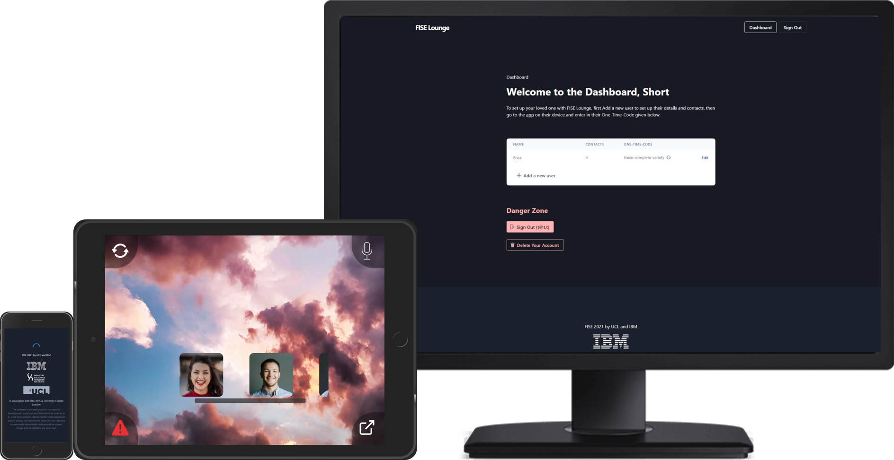

# IBM FISE Lounge - an interactive and privacy safe video-calling platform for those in social isolation

> IBM FISE Lounge is an application that acts as a smart and interactive video-calling platform for the elderly and others to use in the current pandemic, and other situations where social isolation is a major issue. It provides a simple interface with a standalone dashboard for more tech-savvy relatives to set up the Lounge app and preferences on the elderly relative's behalf. 

> The application is a part of the integrated [FISE Ecosystem](link) that includes [FISE AskBob](https://github.com/UCL-COMP0016-2020-Team-39/AskBob) and [FISE Concierge](link).

## Key Features:
1. Privacy. IBM Watson or FISE AskBob
2. Emergency messages via sms
3. Extendable through plugins
4. Interactive through 360 VR backgrounds

## Contributors:

This project has been developed by a group of students at University College London, supervised by Dr Dean Mohamedally (UCL) and John McNamara (IBM)

- Daniel Javadinejad (UCL)
- Radu Echim (UCL)
- Adam Piwowarczyk (UCL)
- Jeremy Lo Ying Ping (UCL)
- Jiaruo Gao (UCL)
- Ak Ihoeghinlan (UCL)
- Calin Hadarean (UCL)
- Adam Peace (UCL)
- Emil Almazov (UCL)
- Rikaz Rameez (UCL)
- Mohammad Syed (UCL)
- Ernest Nkansah-Badu (UCL)

## Project Structure

This repository contains both the web app for FISE (in [`/app`](app)) as well as the dashboard and API (in [`/server`](server)). 

# Docker Installation
You can find our guide on how to install  

# Server Installation

Note: Our documentation uses yarn commands, but npm will also work. You can compare yarn and npm commands in the yarn docs, [here](https://classic.yarnpkg.com/en/docs/migrating-from-npm#toc-cli-commands-comparison).

Ensure you have `yarn` installed (npm also works)

- `cd server`
- `yarn install`
- `cp .env.local.example .env.local` (This file should never be tracked, only the example)
- Fill in all the missing details in `server/.env.local`
- To begin development: `yarn dev`
- To build for production: `yarn build`
- To serve production build: `yarn start`

# App Installation

Ensure you have `yarn` installed (npm also works)

- `cd app`
- `yarn install`
- `cp .env.local.example .env.local` (This file should never be tracked, only the example)
- Fill in all the missing details in `app/.env.local`
- To begin development: `yarn dev`
- To build for production: `yarn build`
- To serve production build: `yarn start`

# Server Documentation

## Overview

- Running on NextJS 9 (different to Express, look it up and be familiar with ES5/ES6 syntax)
- Auth handled by Passport
- Storage in MongoDB (Can easily set up using Atlas)
- All API routes at `localhost:3000/api/*`
- All dashboard pages at `localhost:3000/*`
- All API routes are "pages" in NextJS 9
- All pages are in `/server/pages`, with API routes in `/server/pages/api` and the file path from pages corresponding to the actual path

## Data Types

### User

- The actual account administrator
- They manage the _Consumer_'s FISE account and set it up on the _Consumer_'s device
- They can add mutiple *Consumer*s and add multiple *Contact*s per _Consumer_
- This is the only person who ever accesses the Dashboard

### Consumer

- The elderly person with difficulty contacting their relatives (example)
- This person's data will show up on the FISE app
- Can be related to multiple *Contact*s

### Contact

- Someone the _Consumer_ can call
- Will receive an email when called through the app
- Will receive an email containing emergency voice-clip when sent through the app

If phone number provided:

- Will receive an sms when called through the app
- Will receive an sms containing emergency voice-clip when sent through the app

## Deploying the Server
Overview

Easiest way (local): Docker

- Connect repo to Vercel
- Add all env variables that are in `/server/.env.local.example`
- (NB: Adding `VERCEL_URL` will autopopulate based on whether the build is production or preview)

Easiest way (cloud): Vercel

- Connect repo to Vercel
- Add all env variables that are in `/server/.env.local.example`
- (NB: Adding `VERCEL_URL` will autopopulate based on whether the build is production or preview)

Otherwise: Server

- Follow the above instructions for _Server Installation_ and expose port 3000

# App Documentation
## Deploying the App
Easiest way (local): Docker

Easiest way (cloud): Vercel

- Connect repo to Vercel
- Add all env variables that are in `/app/.env.local.example`

Otherwise: App

- Follow the above instructions for _App Installation_ and expose port of choice
# Server API Routes

## `/api/login`

### POST

Parameters:

- email
- password

## `/api/logout`

### POST

Parameters: None

## `/api/signup`

### POST

Parameters:

- email
- password
- name

## `/api/user`

### GET

Gets the current (based on session) user's data

## `/api/user/delete`

### DELETE

Revokes the current user's session

## `/api/consumer`

### POST

Create a new consumer

Paramaters:

- name
- isCloudEnabled
- isSnowEnabled
- isWatsonTtsEnabled

Success: returns {message: ..., data: consumer}

## `/api/consumer/:consumer_id`

### GET

Get the corresponding consumer data

Success: returns {message: ..., data: consumer}

### PUT

Update the corresponding consumer's data

Parameters:

- name
- isCloudEnabled
- isSnowEnabled
- isWatsonTtsEnabled

Success: returns {message: ..., data: consumer, consumer_id}

### DELETE

Delete the corresponding consumer

### POST

Refreshes one-time-code of the corresponding consumer

## `/api/contact`

### POST

Create a new contact

Parameters:

- consumer_id
- name
- email
- profileImage (should be `Base64` encoded)
- relation
- phone

Success: returns {message: ..., data: newContact}

## `/api/contact/:contact_id`

### GET

Get the corresponding contact data

Success: returns {
message: ...,
data:
contact,
consumer_id,
consumer_name,
}

### PUT

Update the corresponding contact's data

Parameters:

- [name]
- [email]
- profileImage (should be `Base64` encoded)
- [relation]
- phone

Success returns...

### DELETE

Delete the corresponding contact

## `/api/otc/:otc`

### GET

Get the corresponding consumer's data

### POST

Sends a call notification email to the desired contact

Parameters:

- contact_id

## `/api/otc/watson/:otc`

### POST

Parse audio through IBM Watson API

Parameters:

- `req.body` should be `Base64` encoded `audio/mp3`

## `/api/backgrounds/`

### POST

Adds corresponding background to consumer's backgrounds

Parameters:

- imageFile (should be `Base64` encoded or `URL` string)
- imageName
- isVR
- consumer_id

### DELETE

Deletes the corresponding background

Parameters:

- image_id
- consumer_id

# IBM Watson voice commands

## Setup

- Register an IBM Cloud account
- Create _Watson Assistant_, _Speech-To-Text_ and _Text-To-Speech_ resources
- Add service credentials for respective resource in server `.env.local`.
- For `WATSON_ASSISTANT_ID` only add key following ServiceId-XXXXXXXX-XXXX-XXXX-XXXX-XXXXXXXXXXXX
- Launch Watson Assistant inside IBM Cloud
- Create _dialog skill_ by uploading `watson-skill.json` (change location)

## Valid commands

- Changing background
- Calling contact

# AskBob voice commands

## Setup

- Follow AskBob's installation guide [here](https://github.com/UCL-COMP0016-2020-Team-39/AskBob) or use above mentioned docker instalaltion
- Ensure that the required deepspeech models are downloaded
- Add the AskBob instance URL in `app/.env.local`
- AskBob supports a rich set of plugins for custom commands,

## Valid commands

### Default

- Changing background
- Calling contact

### AskBob-Plugins

- What's the weather
- Tell me a joke
- [...]

# Plugins

IBM Fise Lounge has support for custom plugins and apps that can be loaded through an iframe. This includes most web-apps, videos, HTML5 apps. `app/public/plugins.html` `app/components/pluginComponent`.

As a template the `plugins.html` renders a white page with a list of free games, coronavirus advice, and a live BBC news feed.
