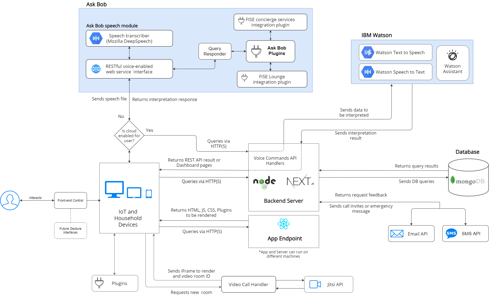

# IBM FISE Lounge - an interactive and privacy safe video-calling platform for those in social isolation

> IBM FISE Lounge is an application that acts as a smart and interactive video-calling platform for the elderly and others to use in the current pandemic, and other situations where social isolation is a major issue. It provides a simple interface with a standalone dashboard for more tech-savvy relatives to set up the Lounge app and preferences on the elderly relative's behalf.
>
> The application is a part of the integrated [FISE Ecosystem](link) that includes [FISE AskBob](https://github.com/UCL-COMP0016-2020-Team-39/AskBob) and [FISE Concierge](link).

## Key Features:

1. Option to Privacy. Use IBM Watson (cloud) or FISE AskBob (privacy) for voice commands.
2. Reliable video-calling using the Jitsi API.
3. Accesible invites through SMS or Email.
4. Emergency messages via SMS.
5. Extendable plugins (games, BBC news feed, etc.)
6. Interactive and customizable 360-VR, static or URL backgrounds.

## Contributors:

This project has been developed by a group of students at University College London, supervised by Dr Dean Mohamedally (UCL) and John McNamara (IBM)

- Daniel Javadinejad (UCL)
- Radu Echim (UCL)
- Adam Piwowarczyk (UCL)
- Jeremy Lo Ying Ping (UCL)
- Jiaruo Gao (UCL)
- Ak Ihoeghinlan (UCL)
- Calin Hadarean (UCL)
- Adam Peace (UCL)
- Emil Almazov (UCL)
- Rikaz Rameez (UCL)
- Mohammad Syed (UCL)
- Ernest Nkansah-Badu (UCL)

## Project Structure

This repository contains both the web app for FISE (in [`/app`](app)) as well as the dashboard and API (in [`/server`](server)).

Application is a React app ([`/app/`](app))

- static assets in [`./public/`](app/public)
- frontend pages available [`./src/pages/`](app/src/pages)
- components in [`./src/components/`](app/src/components)
- utility functions in [`./src/utils/`](app/src/util)
- CSS styles in [`./src/styles/`](app/src/styles)
- component tests with Jest and Enzyme in [`./test/`](app/test)
- environment file example [`./.env.local.example`](app/.env.local.example) (must be renamed to `.env.local` on deployment)

Server is a Next.js app ([`/server/`](server))

- static assets in [`./public/`](server/public)
- UI pages available [`./src/pages/`](server/pages) and [`./src/pages/dashboard`](server/pages/dashboard)
- components in [`./src/components/`](server/src/components)
- API Endpoints in [`./src/pages/api`](server/pages/api)
- utility functions in [`./src/utils/`](server/src/utils)
- shared library files in [`./src/lib/`](server/src/lib)
- environment file example [`./.env.local.example`](server/.env.local.example) (must be renamed to `.env.local` on deployment)

Below is our System Architecture Diagram:

# Installation

## Docker Installation

We recommend you to use docker for production deployment on user devices as it is privacy-safe due to all services running locally. If you're on a Windows device we have provided a batch file that will get everything (both app and server) up and running with one-click. You can find our guide on how to install and deploy docker [here](/[repo]/tree/docker/docs/docker_installation/docker_installation.md).

## Server Installation

Note: Our documentation uses yarn commands, but npm will also work. You can compare yarn and npm commands in the yarn docs, [here](https://classic.yarnpkg.com/en/docs/migrating-from-npm#toc-cli-commands-comparison).

Ensure you have `yarn` installed (or npm)

- `cd server`
- `yarn install`
- `cp .env.local.example .env.local` (This file should never be tracked, only the example)
- Fill in all the missing details in `server/.env.local`, follow the [Environment Variables](#environment-variables) guide
- To begin development: `yarn dev`
- To build for production: `yarn build`
- To serve production build: `yarn start`

## App Installation

Ensure you have `yarn` installed (or npm)

- `cd app`
- `yarn install`
- `cp .env.local.example .env.local` (This file should never be tracked, only the example)
- Fill in all the missing details in `app/.env.local`, follow the [Environment Variables](#environment-variables) guide
- To begin development: `yarn dev`
- To build for production: `yarn build`
- To serve production build: `yarn start`

# Deployment

Note: There are many ways to deploy both the app and server, you are not restricted to using the services we mention.

## Deploying the Server

Easiest way (local): Docker

Easiest way (cloud): Vercel

- Sign up / in to your Vercel account
- Create a new project
- Select "Import Git Repository" and import your copy of this repository.
- Select the server folder (you should see a Next JS logo by the folder)
- Add all env variables that are in `/server/.env.local.example`
- (NB: Adding `VERCEL_URL` will autopopulate based on whether the build is production or preview)

Otherwise (cloud): Azure, DigitalOcean, AWS, IBM Cloud etc.

## Deploying the App

Easiest way (local): Docker

Easiest way (cloud): Vercel

- Connect repo to Vercel
- Add all env variables that are in `/app/.env.local.example`

Otherwise (local):

- Follow the above instructions for [App Installation](#app-installation) and expose port of choice

Otherwise (cloud): Azure and similiar

- Follow the above instructions for [App Installation](#app-installation) and expose port of choice

## Environment Variables

Env variables follow the `KEY=VALUE` format. A `VALUE` that contains white-spaces must be wrapped in quotes (i.e. `KEY="VALUE WITH WHITESPACE"`).

Server:

- `JITSI_MEET_URL`: URL of Jitsi Meet instance (can use `meet.jit.si`).
- `SESSION_COOKIE_SECRET`: a 32-digit base 10 number, used for encrypting the session cookie.
- `NEXT_PUBLIC_APP_URL`: URL of running app instance (used for adding link to app from dashboard pages).
- Database Env Variables:
  - `MONGODB_URI`: URI of MongoDB database instance (i.e. for Docker `mongodb://mongo:27017`). Might need to add database name at the end of the URI path as such `mongodb://mongo:27017/databaseName`.
  - `MONGODB_DB`: MongoDB Database name (in [HTML URL Encoding](https://www.w3schools.com/tags/ref_urlencode.ASP) format).
- SMS & Email Env Variables:
- `EMAIL_HOST`: email service provider host URL.
- `EMAIL_PROVIDER_USERNAME`: email from the service provider (i.e. `example@example.uk`).
- `EMAIL_PROVIDER_PASS`: password of the email account or external password from the service provider.
- `EMAIL_FROM`: email sender name, appears as sender in emails.
- `SMS_ENDPOINT`: SMS API endpoint (we recommend using [D7SMS](https://d7networks.com/)).
- `SMS_API_KEY`: SMS API key provided
- `SMS_FROM`: sender name, appears as sender in sent SMS messages.

- IBM Watson Env Variables:

  - `STT_ENDPOINT`: Watson Speech to Text endpoint URL.
  - `STT_API_KEY`= Watson Speech to Text API key.
  - `WATSON_ENDPOINT`: Watson Assistant enpoint URL.
  - `WATSON_API_KEY`: Watson Assistant API key.
  - `WATSON_ASSISTANT_ID`: Watson Assistant instance ID (find how to get the Watson Assistant instance ID, [here](https://stackoverflow.com/questions/53269368/ibm-cloud-watson-assistant-how-to-get-the-id-of-a-workspace)).

  - `TTS_ENDPOINT`: Text to Speech endpoint URL.
  - `TTS_API_KEY`="48Lqv3DPHQzjbc9pVP7lU_kVlY0UPngbiiQ_flyUWMbg"

  IBM Watson Docs on how to get started with Watson services:

  - [Watson Assistant](https://cloud.ibm.com/docs/assistant?topic=assistant-getting-started)
  - [Text to Speech](https://cloud.ibm.com/docs/text-to-speech?topic=text-to-speech-gettingStarted)
  - [Speech to Text](https://cloud.ibm.com/docs/speech-to-text?topic=speech-to-text-gettingStarted)

- Askbob Env Variables:
  - `ASKBOB_ENDPOINT`: URL of Ask Bob running instance (i.e. with Docker `http://localhost:8000`)

Application:

- `REACT_APP_SERVER_URL`: URL of server (used as target URL for Server API request)
- `REACT_APP_ASKBOB_URL`: URL of running Ask Bob instance (used as target URL for voice command requests)

# Server Documentation

## Overview

- Running on NextJS 9 (different to Express, look it up and be familiar with ES5/ES6 syntax)
- Auth handled by Passport
- Storage in MongoDB (Can easily set up using Atlas)
- All API routes at `localhost:3000/api/*`
- All dashboard pages at `localhost:3000/*`
- All API routes are "pages" in NextJS 9
- All pages are in `/server/pages`, with API routes in `/server/pages/api` and the file path from pages corresponding to the actual path

## Data Types

### User

- The actual account administrator
- They manage the _Consumer_'s FISE account and set it up on the _Consumer_'s device
- They can add mutiple *Consumer*s and add multiple *Contact*s per _Consumer_
- This is the only person who ever accesses the Dashboard

### Consumer

- The elderly person with difficulty contacting their relatives (example)
- This person's data will show up on the FISE app
- Can be related to multiple *Contact*s

### Contact

- Someone the _Consumer_ can call
- Will receive an email when called through the app
- Will receive an email containing emergency voice-clip when sent through the app

If phone number provided:

- Will receive an sms when called through the app
- Will receive an sms containing emergency voice-clip when sent through the app

# Server API Routes

## `/api/login`

### POST

Parameters:

- email=[string]
- password=[string]

Success:

- Code: `200`
- Content: `{ "done": true }`

## `/api/logout`

### POST

Parameters: None

Success:

- Code `304`
- response with `Location` header redirects root URL `/`

## `/api/signup`

### POST

Parameters:

- email=[string]
- password=[string]
- name=[string]

Success:

- Code: `200`
- Content: `{ "done": true }`

## `/api/user`

### GET

Gets the current (based on session) user's data

Success:

- Code: `200`
- Content: `{ data: { user: { name, email, consumers }}}`

User not found or no database access:

- Code: `200`
- Content: `{ data: null, message: "Unauthorized" }`

## `/api/user/delete`

### DELETE

Revokes the current user's session

Success:

- Code: `200`
- Content: `{ message: "Deleted successfully" }`

## `/api/consumer`

### POST

Create a new consumer

Paramaters:

- name=[string]
- isCloudEnabled=[boolean | string]
- isSnowEnabled=[boolean | string]
- isWatsonTtsEnabled=[boolean | string]

Success:

- Code: `200`
- Content: `{ message: "Consumer added successfully", data: consumer }`

## `/api/consumer/:consumer_id`

### GET

Get the corresponding consumer data

Success:

- Code: `200`
- Content: `{ message: "Consumer Data found", data: consumer }`

### PUT

Update the corresponding consumer's data

Parameters:

- name=[string]
- isCloudEnabled=[boolean | string]
- isSnowEnabled=[boolean | string]
- isWatsonTtsEnabled=[boolean | string]

Success:

- Code: `200`
- Content: `{ message: "Consumer updated successfully", data: { ...consumer, consumer_id }, }`

### DELETE

Delete the corresponding consumer

Success:

- Code: `200`
- Content: `{ message: "Consumer Deleted successfully" }`

### POST

Refreshes one-time-code of the corresponding consumer

Success:

- Code: `200`
- Content: `{ message: "Consumer updated successfully", data: { ...consumer, consumer_id }, }`

## `/api/contact`

### POST

Create a new contact

Parameters:

- consumer_id=[string]
- name=[string]
- email=[string]
- profileImage=[string] (should be `Base64` encoded)
- relation=[integer 0-10]
- phone=[string, valid phone number] (JS regex: `/^\+[1-9]\d{1,14}$/`)

Success:

- Code: `200`
- Content: `{ message: "Contact added successfully", data: newContact }`

Contact already exists:

- Code: `400`
- Content: `{ message: "A contact with that email already exists" }`

## `/api/contact/:contact_id`

### GET

Get the corresponding contact data

Success:

- Code: `200`
- Content: `{ message: "Contact Data found", data: { contact, consumer_id, consumer_name }`

### PUT

Update the corresponding contact's data

Parameters:

- consumer_id=[string]
- name=[string]
- email=[string]
- profileImage=[string] (should be `Base64` encoded)
- relation=[integer 0-10]
- phone=[string, valid phone number] (JS regex: `/^\+[1-9]\d{1,14}$/`)

Success:

- Code: `200`
- Content: `{ message: "Contact updated successfully", data: { newContact, consumer_id }`

### DELETE

Delete the corresponding contact

Success:

- Code: `200`
- Content: `{ message: "Contact Deleted successfully", data: { consumer_id }}`

## `/api/otc/:otc`

### GET

Get the corresponding consumer's data

Success:

- Code: `200`
- Content: `{ message: "Data found", data: consumer }`

### POST

Sends a call notification email and/or SMS to the desired contact

Parameters:

- contact_id=[string]

- Optional:
  - sms=[boolean]

Success:

- Code: `200`
- Content: `{ message: "Invite email Sent successfully" }`

On both email and SMS services error:

- Code: `500`
- Content: `{ message: "Both email and sms services are not responding" }`

## `/api/otc/watson/:otc`

### POST

Parse audio through IBM Watson API

Parameters:

- `req.body` should be `Base64` encoded `audio/mp3`

Success:

- Code: `200`
- Content: `{ data: { action, contact_id, text, reply }}`
  - action: intent recognized by Watson Assistant [`"startCall"` | `"changeBackground"` | `"startExercise"`]
  - contact_id: if action is `"startCall"`, the contact_id of the callee
  - text: string text resulted from transcribing the speech
  - reply: text reply from Watson Assistant

No intent recognized by Watson Assistant:

- Code: `200`
- Content: `{ message: "Watson couldn't recognize intents", data: { action, contact_id, text, reply }}`

## `/api/otc/text-to-speech/:otc`

### POST

Synthesize speech from text

Parameters:

- text=[string]

Success:

- Code: `200`
- Content: body containing the synthesized speech as `audio/wav`

## `/api/otc/emergency/:otc`

### POST

Send emergency message to all contacts

Parameters:

- text=[string]

Success:

- Code: `200`
- Content: `{ message: "Invite Sent successfully" }`

On both email and SMS services error:

- Code: `500`
- Content: `{ message: "No emergency message was sent" }`

## `/api/backgrounds/`

### POST

Adds corresponding background to consumer's backgrounds

Parameters:

- imageFile=[string] (should be `Base64` encoded or `URL` string)
- imageName=[string]
- isVR=[boolean]
- consumer_id=[string]

Success:

- Code: `200`
- Content: `{ message: "New background uploaded successfully" }`

### DELETE

Deletes the corresponding background

Parameters:

- image_id=[string]
- consumer_id=[string]

Success:

- Code: `200`
- Content: `{ message: "Background deleted successfully", }`

# IBM Watson Voice Commands

## Setup

- Register an IBM Cloud account
- Create _Watson Assistant_, _Speech-To-Text_ and _Text-To-Speech_ resources
- Add service credentials for respective resource in server `.env.local`.
- For `WATSON_ASSISTANT_ID` only add key following ServiceId-XXXXXXXX-XXXX-XXXX-XXXX-XXXXXXXXXXXX
- Launch Watson Assistant inside IBM Cloud
- Create _dialog skill_ by uploading `watson_skill.json` that you find in the `/server` folder

## Valid commands

- Change background
- Call [contact name]

If you want any other _custom_ commands, you can create them with Watson's dialogue......

# AskBob voice commands

## Setup

- Follow AskBob's installation guide [here](https://github.com/UCL-COMP0016-2020-Team-39/AskBob) or use above mentioned docker instalaltion
- Ensure that the required deepspeech models are downloaded
- Add the AskBob instance URL in `app/.env.local`
- AskBob supports a rich set of plugins for custom commands,

## Valid commands (update phrasing)

### Default

- Change background
- Call [contact name]

### FISE Concierge Utilities

- What's the weather at different locations
- What's the air quality at different locations
- What's the defintion of words
- What's the synonym of words

### FISE Concierge Food

- Tell me a recipe for certain food
- Tell me a recipe by ingredient
- Tell me random recipe

### FISE Concierge Food

- Value of a stock
- Charities in a location

### FISE Concierge Food

- Value of a stock
- Charities in a location

# Plugins

The Plugin component is [`app/components/Plugin.jsx`](). This is wrapped by the [`app/components/PluginComponent.jsx`]() component in an iframe.

To add new plugins, modify the return value of the `Plugin` component by adding your custom html and JS. If any variable initialization is needed, it can be added to the `useEffect` hook of the component.

We have provided an example of the things you can achieve with [`Plugin`](), these include online games (chess, checkers, 70's TV Show, etc.), live BBC news feed, Coronavirus informational videos, etc.

[repo]: https://github.com/DanJav/IBM-FISE-Lounge-Interactive-Videocall
